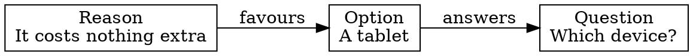
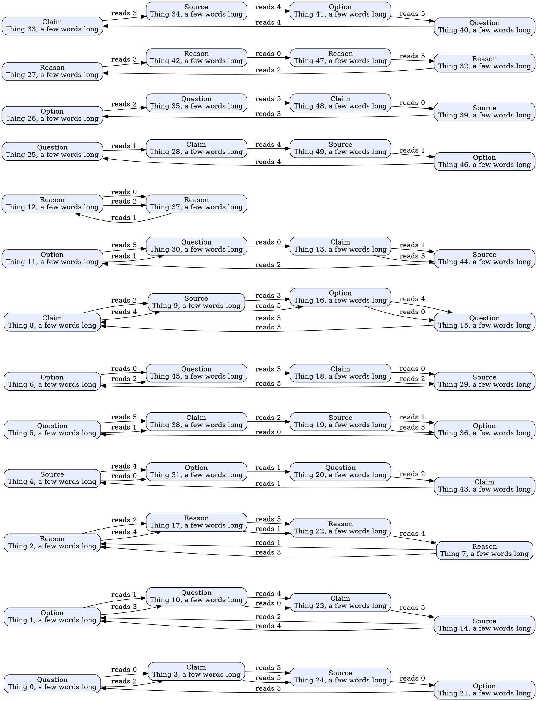

# Graphviz spike test

Read the line under each drawing: how long the engine took to start, and to draw.

A small graph:

```graphviz-spike
digraph G {
  rankdir=LR;
  o [shape=box, label="Option\nA tablet"];
  q [shape=box, label="Question\nWhich device?"];
  r [shape=box, label="Reason\nIt costs nothing extra"];
  o -> q [label="answers"];
  r -> o [label="favours"];
}
```

A graph of 50 things and 70 links:

```graphviz-spike
digraph G {
  rankdir=LR;
  n0 [shape=box, style="rounded,filled", fillcolor="#e8eefc", label="Question\nThing 0, a few words long"];
  n1 [shape=box, style="rounded,filled", fillcolor="#e8eefc", label="Option\nThing 1, a few words long"];
  n2 [shape=box, style="rounded,filled", fillcolor="#e8eefc", label="Reason\nThing 2, a few words long"];
  n3 [shape=box, style="rounded,filled", fillcolor="#e8eefc", label="Claim\nThing 3, a few words long"];
  n4 [shape=box, style="rounded,filled", fillcolor="#e8eefc", label="Source\nThing 4, a few words long"];
  n5 [shape=box, style="rounded,filled", fillcolor="#e8eefc", label="Question\nThing 5, a few words long"];
  n6 [shape=box, style="rounded,filled", fillcolor="#e8eefc", label="Option\nThing 6, a few words long"];
  n7 [shape=box, style="rounded,filled", fillcolor="#e8eefc", label="Reason\nThing 7, a few words long"];
  n8 [shape=box, style="rounded,filled", fillcolor="#e8eefc", label="Claim\nThing 8, a few words long"];
  n9 [shape=box, style="rounded,filled", fillcolor="#e8eefc", label="Source\nThing 9, a few words long"];
  n10 [shape=box, style="rounded,filled", fillcolor="#e8eefc", label="Question\nThing 10, a few words long"];
  n11 [shape=box, style="rounded,filled", fillcolor="#e8eefc", label="Option\nThing 11, a few words long"];
  n12 [shape=box, style="rounded,filled", fillcolor="#e8eefc", label="Reason\nThing 12, a few words long"];
  n13 [shape=box, style="rounded,filled", fillcolor="#e8eefc", label="Claim\nThing 13, a few words long"];
  n14 [shape=box, style="rounded,filled", fillcolor="#e8eefc", label="Source\nThing 14, a few words long"];
  n15 [shape=box, style="rounded,filled", fillcolor="#e8eefc", label="Question\nThing 15, a few words long"];
  n16 [shape=box, style="rounded,filled", fillcolor="#e8eefc", label="Option\nThing 16, a few words long"];
  n17 [shape=box, style="rounded,filled", fillcolor="#e8eefc", label="Reason\nThing 17, a few words long"];
  n18 [shape=box, style="rounded,filled", fillcolor="#e8eefc", label="Claim\nThing 18, a few words long"];
  n19 [shape=box, style="rounded,filled", fillcolor="#e8eefc", label="Source\nThing 19, a few words long"];
  n20 [shape=box, style="rounded,filled", fillcolor="#e8eefc", label="Question\nThing 20, a few words long"];
  n21 [shape=box, style="rounded,filled", fillcolor="#e8eefc", label="Option\nThing 21, a few words long"];
  n22 [shape=box, style="rounded,filled", fillcolor="#e8eefc", label="Reason\nThing 22, a few words long"];
  n23 [shape=box, style="rounded,filled", fillcolor="#e8eefc", label="Claim\nThing 23, a few words long"];
  n24 [shape=box, style="rounded,filled", fillcolor="#e8eefc", label="Source\nThing 24, a few words long"];
  n25 [shape=box, style="rounded,filled", fillcolor="#e8eefc", label="Question\nThing 25, a few words long"];
  n26 [shape=box, style="rounded,filled", fillcolor="#e8eefc", label="Option\nThing 26, a few words long"];
  n27 [shape=box, style="rounded,filled", fillcolor="#e8eefc", label="Reason\nThing 27, a few words long"];
  n28 [shape=box, style="rounded,filled", fillcolor="#e8eefc", label="Claim\nThing 28, a few words long"];
  n29 [shape=box, style="rounded,filled", fillcolor="#e8eefc", label="Source\nThing 29, a few words long"];
  n30 [shape=box, style="rounded,filled", fillcolor="#e8eefc", label="Question\nThing 30, a few words long"];
  n31 [shape=box, style="rounded,filled", fillcolor="#e8eefc", label="Option\nThing 31, a few words long"];
  n32 [shape=box, style="rounded,filled", fillcolor="#e8eefc", label="Reason\nThing 32, a few words long"];
  n33 [shape=box, style="rounded,filled", fillcolor="#e8eefc", label="Claim\nThing 33, a few words long"];
  n34 [shape=box, style="rounded,filled", fillcolor="#e8eefc", label="Source\nThing 34, a few words long"];
  n35 [shape=box, style="rounded,filled", fillcolor="#e8eefc", label="Question\nThing 35, a few words long"];
  n36 [shape=box, style="rounded,filled", fillcolor="#e8eefc", label="Option\nThing 36, a few words long"];
  n37 [shape=box, style="rounded,filled", fillcolor="#e8eefc", label="Reason\nThing 37, a few words long"];
  n38 [shape=box, style="rounded,filled", fillcolor="#e8eefc", label="Claim\nThing 38, a few words long"];
  n39 [shape=box, style="rounded,filled", fillcolor="#e8eefc", label="Source\nThing 39, a few words long"];
  n40 [shape=box, style="rounded,filled", fillcolor="#e8eefc", label="Question\nThing 40, a few words long"];
  n41 [shape=box, style="rounded,filled", fillcolor="#e8eefc", label="Option\nThing 41, a few words long"];
  n42 [shape=box, style="rounded,filled", fillcolor="#e8eefc", label="Reason\nThing 42, a few words long"];
  n43 [shape=box, style="rounded,filled", fillcolor="#e8eefc", label="Claim\nThing 43, a few words long"];
  n44 [shape=box, style="rounded,filled", fillcolor="#e8eefc", label="Source\nThing 44, a few words long"];
  n45 [shape=box, style="rounded,filled", fillcolor="#e8eefc", label="Question\nThing 45, a few words long"];
  n46 [shape=box, style="rounded,filled", fillcolor="#e8eefc", label="Option\nThing 46, a few words long"];
  n47 [shape=box, style="rounded,filled", fillcolor="#e8eefc", label="Reason\nThing 47, a few words long"];
  n48 [shape=box, style="rounded,filled", fillcolor="#e8eefc", label="Claim\nThing 48, a few words long"];
  n49 [shape=box, style="rounded,filled", fillcolor="#e8eefc", label="Source\nThing 49, a few words long"];
  n0 -> n3 [label="reads 0"];
  n1 -> n10 [label="reads 1"];
  n2 -> n17 [label="reads 2"];
  n3 -> n24 [label="reads 3"];
  n4 -> n31 [label="reads 4"];
  n5 -> n38 [label="reads 5"];
  n6 -> n45 [label="reads 0"];
  n7 -> n2 [label="reads 1"];
  n8 -> n9 [label="reads 2"];
  n9 -> n16 [label="reads 3"];
  n10 -> n23 [label="reads 4"];
  n11 -> n30 [label="reads 5"];
  n12 -> n37 [label="reads 0"];
  n13 -> n44 [label="reads 1"];
  n14 -> n1 [label="reads 2"];
  n15 -> n8 [label="reads 3"];
  n16 -> n15 [label="reads 4"];
  n17 -> n22 [label="reads 5"];
  n18 -> n29 [label="reads 0"];
  n19 -> n36 [label="reads 1"];
  n20 -> n43 [label="reads 2"];
  n21 -> n0 [label="reads 3"];
  n22 -> n7 [label="reads 4"];
  n23 -> n14 [label="reads 5"];
  n24 -> n21 [label="reads 0"];
  n25 -> n28 [label="reads 1"];
  n26 -> n35 [label="reads 2"];
  n27 -> n42 [label="reads 3"];
  n28 -> n49 [label="reads 4"];
  n29 -> n6 [label="reads 5"];
  n30 -> n13 [label="reads 0"];
  n31 -> n20 [label="reads 1"];
  n32 -> n27 [label="reads 2"];
  n33 -> n34 [label="reads 3"];
  n34 -> n41 [label="reads 4"];
  n35 -> n48 [label="reads 5"];
  n36 -> n5 [label="reads 0"];
  n37 -> n12 [label="reads 1"];
  n38 -> n19 [label="reads 2"];
  n39 -> n26 [label="reads 3"];
  n40 -> n33 [label="reads 4"];
  n41 -> n40 [label="reads 5"];
  n42 -> n47 [label="reads 0"];
  n43 -> n4 [label="reads 1"];
  n44 -> n11 [label="reads 2"];
  n45 -> n18 [label="reads 3"];
  n46 -> n25 [label="reads 4"];
  n47 -> n32 [label="reads 5"];
  n48 -> n39 [label="reads 0"];
  n49 -> n46 [label="reads 1"];
  n0 -> n3 [label="reads 2"];
  n1 -> n10 [label="reads 3"];
  n2 -> n17 [label="reads 4"];
  n3 -> n24 [label="reads 5"];
  n4 -> n31 [label="reads 0"];
  n5 -> n38 [label="reads 1"];
  n6 -> n45 [label="reads 2"];
  n7 -> n2 [label="reads 3"];
  n8 -> n9 [label="reads 4"];
  n9 -> n16 [label="reads 5"];
  n10 -> n23 [label="reads 0"];
  n11 -> n30 [label="reads 1"];
  n12 -> n37 [label="reads 2"];
  n13 -> n44 [label="reads 3"];
  n14 -> n1 [label="reads 4"];
  n15 -> n8 [label="reads 5"];
  n16 -> n15 [label="reads 0"];
  n17 -> n22 [label="reads 1"];
  n18 -> n29 [label="reads 2"];
  n19 -> n36 [label="reads 3"];
}
```
